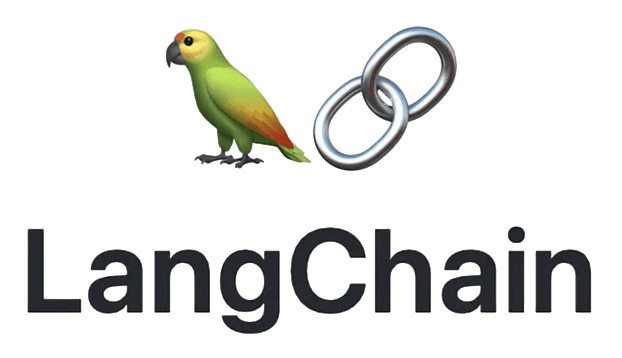
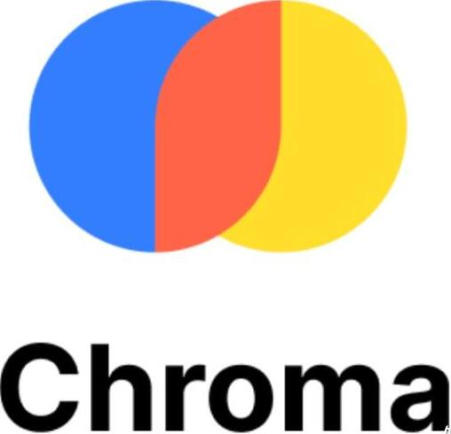
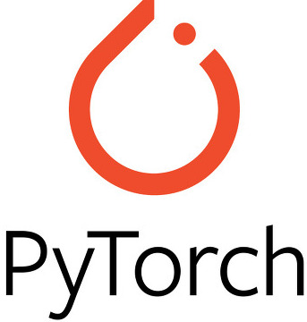
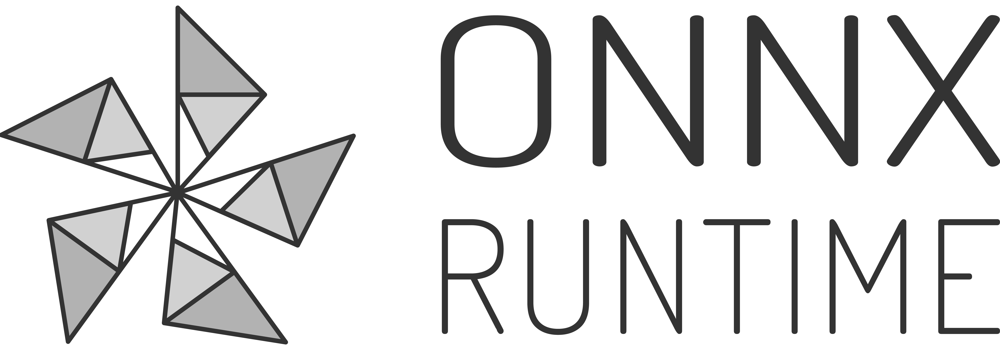
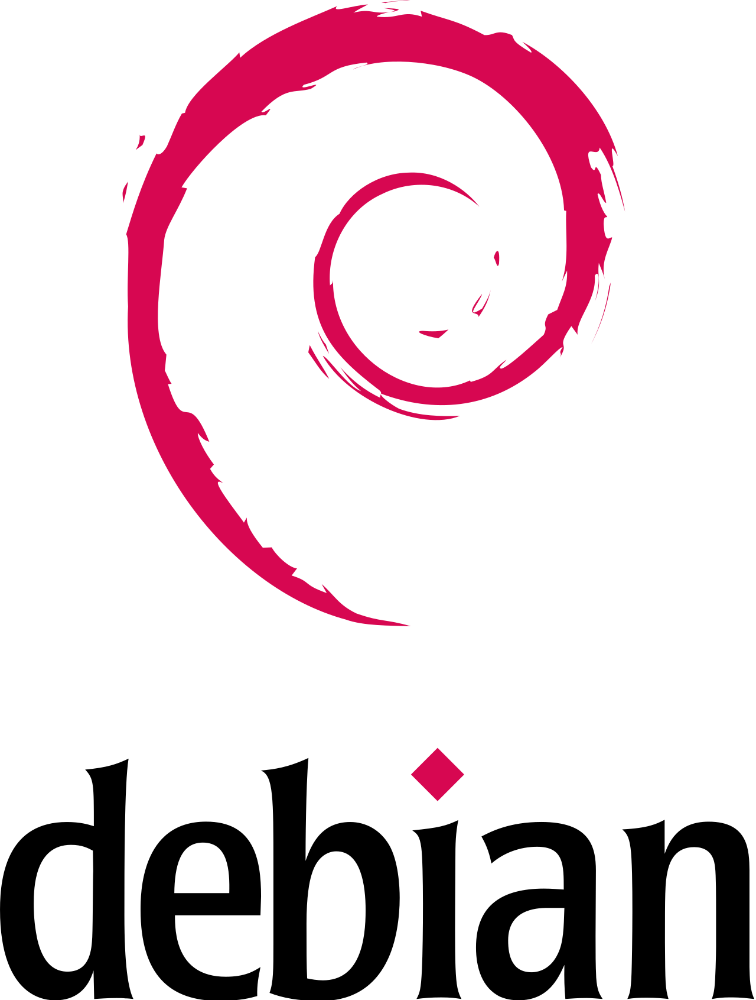
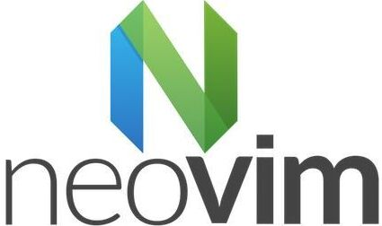

### about me
im just a generic research assistant that likes to program for
fun. i am curious about acceleration, specifically effective and
efficient utilization of llms on the edge. think mixtral8x7b in
your pocket.

## tools i like 🛠️

    &nbsp;&nbsp;&nbsp;
    &nbsp;&nbsp;&nbsp;
    &nbsp;&nbsp;&nbsp;
    &nbsp;&nbsp;&nbsp;
    &nbsp;
    
    &nbsp;&nbsp;&nbsp;&nbsp;
    &nbsp;

